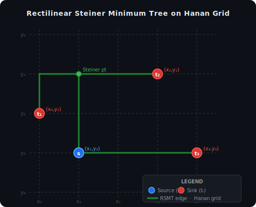

# z3router

**z3router** is an SMT-based solver for multi-net VLSI routing, built on
[Z3](https://github.com/Z3Prover/z3).

It formulates routing as the **Rectilinear Steiner Minimum Tree (RSMT)**
problem, solves it using an **Integer Linear Program (ILP)** lifted into
Z3's SMT framework, and minimizes total wire length across all nets
simultaneously.

---

## Mathematical background

### 1 · The Rectilinear Steiner Minimum Tree (RSMT)

Given a set of pin locations $V$ in the plane, the RSMT problem asks for the
shortest rectilinear (Manhattan-distance) tree that connects all pins.
The tree may include extra *Steiner points* — intermediate nodes that are
not pins — to reduce total wire length.

$$
\text{RSMT}(V) = \arg\min_{T \supseteq V} \sum_{(u,v) \in T} \bigl(|x_u - x_v| + |y_u - y_v|\bigr)
$$

Crucially, **Hanan's theorem** (1966) guarantees that an optimal RSMT always
exists on the *Hanan grid* — the grid formed by drawing horizontal and vertical
lines through every pin. This reduces an infinite search space to a finite graph.



The figure shows four terminals $\{s,\, t_1,\, t_2,\, t_3\}$ (blue = source,
red = sinks) on a Hanan grid. The green tree is the RSMT; the hollow circle is
a Steiner point that is *not* a pin but is required to minimise total wire length.

---

### 2 · Min-cost flow formulation

Routing a single net from source $s$ to sinks $\{t_i\}$ can be cast as a
**min-cost flow** problem on the Hanan-grid graph $G = (V', E)$:

$$
\begin{aligned}
\text{minimise}_{f} \quad & \sum_{(u,v) \in E} w_{u,v} \cdot f_{u,v} \\[6pt]
\text{subject to} \quad
  & \sum_{(s,v)\in E} f_{s,v} = |V|-1
    && \text{source emits } |V|-1 \text{ units} \\
  & \sum_{(v,t)\in E} f_{v,t} = 1
    && \forall\, t \in V \setminus \{s\} \\
  & \sum_{(u,v)\in E} f_{u,v} = \sum_{(v,w)\in E} f_{v,w}
    && \forall\, v \in V' \setminus \{s,t\} \\
  & f_{u,v} \in [0,\; |V|-1]
\end{aligned}
$$

where $w_{u,v}$ is the rectilinear length of edge $(u,v)$.

---

### 3 · Multi-layer extension

Real VLSI routing uses a stack of metal layers connected by vias.
z3router extends the single-layer RSMT to a 3-D layer graph:

- Each **metal layer** has its own Hanan-grid sub-graph with a fixed routing
  direction (horizontal or vertical).
- **Via layers** connect adjacent metal grids at shared $(x, y)$ intersections.
- The flow network spans all layers; an active via forces both adjacent metal
  nodes to be active.
- The **no-overlap** constraint forbids two nets from sharing any node on any
  layer.

---

## Features

- Multi-net, multi-layer routing with via support
- Provably connected trees — flow conservation enforced by Z3 integer constraints
- Hanan-grid pruning — reduces the node count before solving
- Pin-extension layers — `poly` / `tcn` used only as short stubs to reach pins
- Maximum trunk count per layer
- Equal physical wire-length matching across nets
- Physical micron coordinates in `design.py` — normalization is automatic
- Three output modes: interactive 3-D plot · JSON dump (µm) · Synopsys CC shapes

---

## Installation

```bash
pip install z3-solver matplotlib   # runtime dependencies
pip install -e ".[dev]"            # editable install with dev tools
```

Requires **Python ≥ 3.9**.

---

## Quick start

The workflow is split into two files:

| File | Role |
|---|---|
| `design.py` | **You edit this.** One file per cell / design. All coordinates in µm. |
| `run.py` | **Never changes.** Loads any `design.py`, normalizes, solves, outputs. |

**1 · Describe your design in `design.py`:**

```python
from z3router.tech.layer_info import DEFAULT_TECH
TECH = DEFAULT_TECH

LAYER_ORDER   = ["poly", "vg", "tcn", "vt", "m0", "m1"]

NET_LAYER_MAP = {
    "netA": ["poly", "vg", "tcn", "vt", "m0", "m1"],
    "netB": ["poly", "vg", "tcn", "vt", "m0", "m1"],
}

# Physical micron track positions
TRACK_INFO = {
    "poly": [0.000, 0.050, 0.100, 0.200, 0.300],   # µm
    "tcn":  [0.000, 0.050, 0.100, 0.150, 0.300],
    "m0":   [0.000, 0.050, 0.100, 0.150, 0.200],
    "m1":   [0.000, 0.050, 0.100, 0.150, 0.300],
}

# Direct [x, y] pin coordinates in microns
PIN_INFO = {
    "netA": {"tcn":  [[0.050, 0.100], [0.150, 0.200]]},
    "netB": {"poly": [[0.200, 0.200], [0.100, 0.100]]},
}

OPTIONS = {
    "use_hanan_grid":       True,
    "pin_extension_layers": ["poly", "tcn"],
}

EDA_WIDTH_MAP = {"poly": 0.014, "tcn": 0.016, "m0": 0.020, "m1": 0.030}
```

**2 · Run with your chosen output mode:**

```bash
# 3-D matplotlib visualization (axes in µm)
python run.py --design design.py --mode visualize

# JSON dump — via layers: points only, metal layers: segments only (µm)
python run.py --design design.py --mode dump --output result.json

# Write shapes to Synopsys Custom Compiler (must run inside CC session)
python run.py --design design.py --mode eda
```

Different cells → different design files, same `run.py`:

```bash
python run.py --design cells/inv_x1.py   --mode visualize
python run.py --design cells/nand2_x2.py --mode dump --output out/nand2.json
```

---

## Project layout

```
z3router/
├── design.py                    ← YOU EDIT THIS  (physical µm, one per cell)
├── run.py                       ← always the same; normalizes + runs
│
├── docs/                        ← diagrams used by this README
│   ├── hanan_rsmt.svg           #   Hanan grid + RSMT example
│   ├── flow_ilp.svg             #   flow network / ILP formulation
│   ├── ilp_to_smt.svg           #   ILP → Z3 variable mapping
│   └── pipeline.svg             #   end-to-end solver pipeline
│
├── z3router/                    # library package
│   ├── __init__.py
│   ├── tech/
│   │   └── layer_info.py        # Tech dataclass, ViaInfo, DEFAULT_TECH
│   ├── core/
│   │   ├── grid.py              # Hanan-grid builder (integer grid units)
│   │   ├── variables.py         # Z3 Bool node / Int flow variable factories
│   │   └── solver.py            # RouteSolver — top-level entry point
│   ├── constraints/
│   │   └── routing.py           # all Z3 constraint generators (pure functions)
│   │                            #   overlap · connectivity · flow · options
│   ├── io/
│   │   ├── normalize.py         # µm → grid  (normalize_design / normalize_eda_pins)
│   │   ├── visualizer.py        # extract_geometry · scale_geometry · plot_solution
│   │   └── __init__.py
│   └── eda/
│       └── synopsys_cc.py       # Synopsys CC shape writer (accepts µm geometry)
│
├── examples/
│   └── two_net_basic.py         # standalone example showing the full pipeline
├── tests/
│   ├── test_tech.py
│   ├── test_grid.py
│   └── test_normalize.py
├── pyproject.toml
└── README.md
```

---

## Normalization details

`normalize_design` is used by `run.py` and the standalone example:

```python
from z3router.io.normalize import normalize_design

int_track_info, int_pin_info = normalize_design(TRACK_INFO, PIN_INFO, tech)
# int_track_info["poly"] = [0, 100, 200, 400, 600]
# int_pin_info["netA"]["tcn"] = [[100, 200], [300, 400]]
# (units: mfg_grid_res = 0.0005 µm per index)
```

For EDA-tool flows where pin locations come as bounding boxes
(from `cc.db.transform`):

```python
from z3router.io.normalize import normalize_eda_pins

int_track_info, int_pin_info = normalize_eda_pins(track_info, pin_boxes, tech)
```

---

## Dump JSON format

All coordinates are physical microns. Via layers emit `"points"` only;
metal layers emit `"segments"` only:

```json
{
  "netA": {
    "vg":   { "points":   [[0.005, 0.010]] },
    "poly": { "segments": [[[0.005, 0.010], [0.015, 0.010]]] },
    "m0":   { "segments": [[[0.005, 0.010], [0.005, 0.020]]] }
  }
}
```

---

## Solver options

| Key | Type | Description |
|---|---|---|
| `use_hanan_grid` | `bool` | Restrict routing to tracks nearest to each pin |
| `pin_extension_layers` | `list[str]` | Layers used only for short pin stubs |
| `max_trunks_per_net` | `dict[str, int]` | Maximum occupied tracks per layer |
| `equal_wire_length` | `dict` | `{layer: [[net1, net2], ...]}` — matched routing |

---

## Defining a custom technology

```python
from z3router.tech.layer_info import Tech, ViaInfo, LayerVisualization

my_tech = Tech(
    valid_routing_layers = ["m1", "m2", "m3"],
    via_layers           = ["v1", "v2"],
    routing_directions   = {"m1": "horizontal", "m2": "vertical", "m3": "horizontal"},
    via_info             = {
        "v1": ViaInfo(layer_above="m2", layer_below="m1"),
        "v2": ViaInfo(layer_above="m3", layer_below="m2"),
    },
    mfg_grid_res = 0.001,
    layer_vis    = {
        "m1": LayerVisualization(color="#cc0000", level=0.10),
        "v1": LayerVisualization(color="#ff9900", level=0.15),
        "m2": LayerVisualization(color="#0033cc", level=0.20),
    },
)
```

---

## EDA integration (Synopsys Custom Compiler)

```python
from z3router.eda.synopsys_cc import write_shapes_from_geometry
import snps.custom.cmd as cc

# geometry is already in physical µm (output of scale_geometry)
write_shapes_from_geometry(
    cell_view = cc.object.fromOa(tcl.eval('ed')),
    geometry  = geometry,
    tech      = my_tech,
    width_map = {"m1": 0.020, "v1": 0.010, "m2": 0.030},
)
```

---

## Running tests

```bash
pytest
```

---

## References

- M. Hanan, "On Steiner's problem with rectilinear distance," *SIAM Journal on
  Applied Mathematics*, 14(2):255–265, 1966.
- Course notes: *Min-cost flow and RSMT using ILP*, Physical Design / EDA.
- Z3 Theorem Prover: <https://github.com/Z3Prover/z3>

---

## License

MIT
